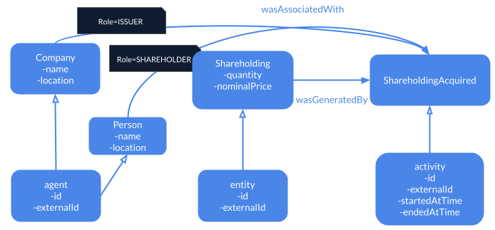
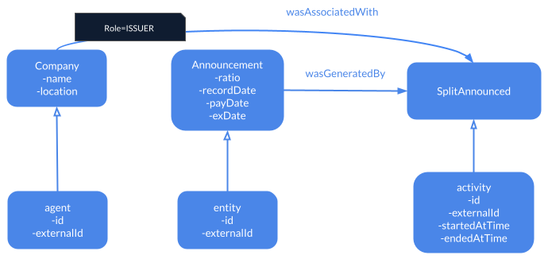
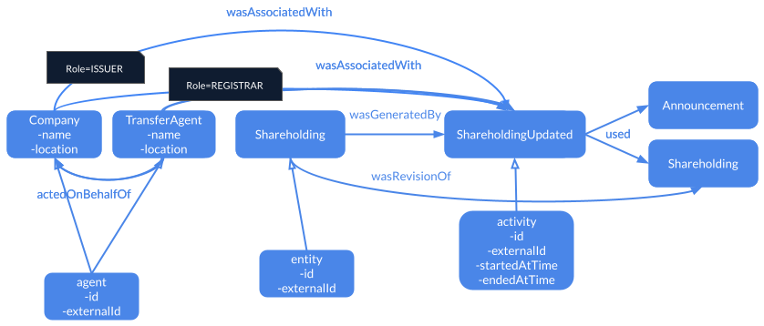

# Corporate Actions Guide

## Modelling Corporate Actions

A stock split is a corporate action that divides the value of each of the outstanding
shares of a company. This simple example captures some aspects of a stock split,
including its announcement and the registration of shares owned.

### Acquiring Shareholding

First we record that an individual investor has become a shareholder in the company.
This is prior to the stock split.



#### Modelling the Company Agent

The `Company` agent has two attributes, its `Name` and its `Location`.
In our Chronicle domain specification this is captured as follows -

```yaml
attributes:
  Name:
    type: String
  Location:
    type: String
agents:
  Company:
    attributes:
      - Name
      - Location
```

#### Modelling the Person Agent

The `Person` agent has two attributes, its `Name` and its `Location`.
In our Chronicle domain specification this is captured as follows -

```yaml
attributes:
  Name:
    type: String
  Location:
    type: String
agents:
  Person:
    attributes:
      - Name
      - Location
```

#### Modelling the Shareholding Entity

The `Shareholding` entity has two attributes, its `Quantity` and its `NominalPrice`.

```yaml
attributes:
  Quantity:
    type: Int
  NominalPrice:
    type: String
entities:
  Shareholding:
    attributes:
      - Quantity
      - NominalPrice
```

#### Modelling the ShareholdingAcquired Activity

The `ShareholdingAcquired` activity has no attributes, but it has an
`Issuer` and a `Shareholder`role.

```yaml
attributes: []
activities:
  ShareholdingAcquired:
    attributes: []
roles:
  - Issuer
  - Shareholder
```

### Announcing Stock Split

Here we record that the company announces a stock split. The announcement includes
information about the split ratio, record date, pay date, and exdate.



#### Modelling the Announcement Entity

The `Announcement` entity has four attributes, its `Ratio`, its `RecordDate`, its
`PayDate`, and its `ExDate`.

```yaml
attributes:
  Ratio:
    type: String
  RecordDate:
    type: String
  PayDate:
    type: String
  ExDate:
    type: String
entities:
  Announcement:
    attributes:
      - Ratio
      - RecordDate
      - PayDate
      - ExDate
```

#### Modelling the SplitAnnounced Activity

The `SplitAnnounced` activity has one attribute `PressDate`, and it also has a role
`Issuer`.

```yaml
attributes:
  PressDate:
    type: String
activities:
  SplitAnnounced:
    attributes:
  - PressDate
roles:
  - Issuer
```

### Updating Shareholding

Here we record that the transfer agent, typically a bank or trust company who acts
on behalf of the company, has updated the person's shareholding as a result of the
stock split.



#### Modelling the TransferAgent Agent

The `TransferAgent` agent has two attributes, its `Name` and its `Location`.
In our Chronicle domain specification this is captured as follows -

```yaml
attributes:
  Name:
    type: String
  Location:
    type: String
agents:
  TransferAgent:
    attributes:
      - Name
      - Location
```

#### Modelling the ShareholdingUpdated Activity

The `ShareholdingUpdated` activity has no attributes, but it has two roles
`Issuer` and `Registrar`.

```yaml
attributes: []
activities:
  ShareholdingUpdated:
    attributes: []
roles:
  - Issuer
  - Registrar
```

### Chronicle Domain

Combining these fragments gives us our Chronicle `corpactions` domain.

```yaml
name: "corpactions"
attributes:
  ExDate:
    type: String
  Name:
    type: String
  Location:
    type: String
  NominalPrice:
    type: String
  PayDate:
    type: String
  PressDate:
    type: String
  Quantity:
    type: Int
  Ratio:
    type: String
  RecordDate:
    type: String
entities:
  Announcement:
    attributes:
      - Ratio
      - RecordDate
      - PayDate
      - ExDate
  ShareHolding:
    attributes:
      - Quantity
      - NominalPrice
activities:
  ShareholdingAcquired:
    attributes: []
  ShareholdingUpdated:
    attributes: []
  SplitAnnounced:
    attributes:
      - PressDate
agents:
  Company:
    attributes:
      - Name
      - Location
  Person:
    attributes:
      - Name
      - Location
  TransferAgent:
    attributes:
      - Name
      - Location
roles:
  - ISSUER
  - REGISTRAR
  - SHAREHOLDER
```

## Recording Corporate Actions

In this example we will create a `Company`, a `Person`, and a `TransferAgent` agent,
which will then embark on the following activities:

1. A `ShareholdingAcquired` activity to record that an individual investor has become
   a shareholder in the company.

1. A `SplitAnnounced` activity to record that the company announces a stock split.

1. A `ShareholdingUpdated` activity to that the `TransferAgent` acting on behalf
   of the company updated the investor's `Shareholding`.

### Record Agents

```graphql
  mutation defineAgents {
    defineCompanyAgent(
      externalId: "FTXCorp"
      attributes: { nameAttribute: "FTXCorp", locationAttribute: "Bahamas" }
    ) {
      context
      txId
    }
    definePersonAgent(
      externalId: "NinjaCsilla"
      attributes: { nameAttribute: "NinjaCsilla", locationAttribute: "Barcelona" }
    ) {
      context
      txId
    }
    defineTransferAgentAgent(
      externalId: "Bank"
      attributes: { nameAttribute: "Bank", locationAttribute: "London" }
    ) {
      context
      txId
    }
  }
```

```json
{
  "data": {
    "defineCompanyAgent": {
      "context": "chronicle:agent:FTXCorp",
      "txId": "412701fd-9b4c-480b-a264-f6b05027704f"
    },
    "definePersonAgent": {
      "context": "chronicle:agent:NinjaCsilla",
      "txId": "12b258ab-6fb1-4477-868a-e76b5094af73"
    },
    "defineTransferAgentAgent": {
      "context": "chronicle:agent:Bank",
      "txId": "adb3adca-3cc9-445b-8fba-c9c1651640be"
    }
  }
}
```

### Record ShareholdingAcquiredActivity

```graphql
  mutation defineActivities {
    defineShareholdingAcquiredActivity(externalId: "ShareholdingAcquired") {
      context
      txId
    }
  }
```

```json
{
  "data": {
    "defineShareholdingAcquiredActivity": {
      "context": "chronicle:activity:ShareholdingAcquired",
      "txId": "b9211c6b-7b44-4031-827e-6410d10f79f4"
    }
  }
}
```

### Record the Agents' Role in the ShareholdingAcquiredActivity

```graphql
mutation issuerAssociate {
  wasAssociatedWith(
    activity: { externalId: "ShareholdingAcquired" },
    responsible: { externalId: "FTXCorp" },
    role: ISSUER) {
    context
    txId
  }
}
```

```json
{
  "data": {
    "wasAssociatedWith": {
      "context": "chronicle:agent:FTXCorp",
      "txId": "f43ce9dd-b9e4-41ee-a183-51ee4d1ed2c0"
    }
  }
}
```

```graphql
mutation shareholderAssociate{
  wasAssociatedWith(
    activity: { externalId: "ShareholdingAcquired" },
    responsible: { externalId: "NinjaCsilla" },
    role: SHAREHOLDER) {
    context
    txId
  }
}
```

```json
{
  "data": {
    "wasAssociatedWith": {
      "context": "chronicle:agent:NinjaCsilla",
      "txId": "5df4650b-ed11-41a7-8517-eacf001be125"
    }
  }
}
```

### Record the Execution of the ShareholdingAcquiredActivity

```graphql
mutation executeActivity {
  instantActivity(
    id: { externalId: "ShareholdingAcquired" }) {
    context
    txId
  }
}
```

```json
{
  "data": {
    "instantActivity": {
      "context": "chronicle:activity:ShareholdingAcquired",
      "txId": "4f61af7f-c39a-4bd9-a60a-97a505c747a1"
    }
  }
}
```

### Record the Creation of the ShareholdingEntity

```graphql
mutation defineShareholding {
  defineShareHoldingEntity(
    externalId: "Shareholding"
    attributes: { quantityAttribute: 1, nominalPriceAttribute: "one pound" }
  ) {
    context
  }
}
```

```json
{
  "data": {
    "defineShareHoldingEntity": {
      "context": "chronicle:entity:Shareholding"
    }
  }
}
```

### Record that ShareholdingAcquired Generated the Shareholding

```graphql
mutation generated {
  wasGeneratedBy(id: { externalId: "Shareholding" },
    activity: { externalId: "ShareholdingAcquired" }) {
    context
    txId
  }
}
```

```json
{
  "data": {
    "wasGeneratedBy": {
      "context": "chronicle:entity:Shareholding",
      "txId": "e2d02121-94a2-49e8-9c2b-c2956fcf28da"
    }
  }
}
```

### Record the SplitAnnouncedActivity

```graphql
mutation splitAnnounced {
  defineSplitAnnouncedActivity(
    externalId: "SplitAnnounced"
    attributes: { pressDateAttribute: "Yesterday" }
  ) {
    context
    txId
  }
}
```

```json
{
  "data": {
    "defineSplitAnnouncedActivity": {
      "context": "chronicle:activity:SplitAnnounced",
      "txId": "87696d17-ab8b-4e36-986e-2ae745ab66d5"
    }
  }
}
```

### Record the Role of the CompanyAgent in the SplitAnnouncedActivity

```graphql
mutation associateSplit {
  wasAssociatedWith(
    activity: {externalId: "SplitAnnounced"}
    responsible: {externalId: "FTXCorp"}
    role: ISSUER
  ) {
    context
    txId
  }
}
```

```json
{
  "data": {
    "wasAssociatedWith": {
      "context": "chronicle:agent:FTXCorp",
      "txId": "44c5a646-52f5-4cbc-85f3-d5b16d6072fd"
    }
  }
}
```

### Record the Execution of the SplitAnnouncedActivity

```graphql
mutation announce {
  instantActivity(
    id: { externalId: "SplitAnnounced" }
    agent: { externalId: "FTXCorp" }
  ) {
    context
    txId
  }
}
```

```json
{
  "data": {
    "instantActivity": {
      "context": "chronicle:activity:SplitAnnounced",
      "txId": "e7170a8e-d233-4445-ac1f-bc47534c56e2"
    }
  }
}
```

### Record the Creation of the AnnouncementEntity

```graphql
mutation announcementEntity {
  defineAnnouncementEntity(
    externalId: "Announcement"
    attributes: {
      ratioAttribute: "2:1"
      recordDateAttribute: "Today"
      payDateAttribute: "Tomorrow"
      exDateAttribute: "Day After Tomorrow"
    }
  ) {
    context
    txId
  }
}
```

```json
{
  "data": {
    "defineAnnouncementEntity": {
      "context": "chronicle:entity:Announcement",
      "txId": "fcb55142-9b11-4dd3-8db6-eb233530544c"
    }
  }
}
```

### Record that the SplitAnnouncedActivity Generated the Announcement

```graphql
mutation generatedBySplit {
  wasGeneratedBy(
    activity: { externalId: "SplitAnnounced" }
    id: { externalId: "Announcement" }
  ) {
    context
    txId
  }
}
```

```json
{
  "data": {
    "wasGeneratedBy": {
      "context": "chronicle:entity:Announcement",
      "txId": "a8580faf-e010-45b2-8143-0be9ce5e80b7"
    }
  }
}
```

### Record the ShareholdingUpdatedActivity

```graphql
mutation shareholdingUpdated {
  defineShareholdingUpdatedActivity(externalId: "ShareholdingUpdated") {
    context
    txId
  }
}
```

```json
{
  "data": {
    "defineShareholdingUpdatedActivity": {
      "context": "chronicle:activity:ShareholdingUpdated",
      "txId": "35e6b17c-b512-4825-86ab-b7886cb8f654"
    }
  }
}
```

### Record the Role of the TransferAgent in the ShareholdingUpdatedActivity

```graphql
mutation associateUpdated {
  wasAssociatedWith(
    activity: { externalId: "ShareholdingUpdated" }
    responsible: { externalId: "Bank" }
    role: REGISTRAR
  ) {
    context
    txId
  }
}
```

```json
{
  "data": {
    "wasAssociatedWith": {
      "context": "chronicle:agent:Bank",
      "txId": "401e0ff2-aac7-471e-9e9d-e3b7f7d43a84"
    }
  }
}
```

### Record that the ShareholdingUpdatedActivity Used Previously Created Entities

```graphql
mutation used1 {
  used(activity: {externalId: "ShareholdingUpdated"}, id: {externalId: "Announcement"}) {
    context
  }
}
```

```json
{
  "data": {
    "used": {
      "context": "chronicle:entity:Announcement"
    }
  }
}
```

```graphql
mutation used2 {
  used(activity: {externalId: "ShareholdingUpdated"}, id: {externalId: "Shareholding"}) {
    context
  }
}
```

```json
{
  "data": {
    "used": {
      "context": "chronicle:entity:Shareholding"
    }
  }
}
```

### Record that the TransferAgent Acted on Behalf of the Company

```graphql
mutation actedOnBehalf {
  actedOnBehalfOf(
    responsible: { externalId: "FTXCorp" }
    activity: { externalId: "ShareholdingUpdated" }
    delegate: { externalId: "Bank" }
    role: REGISTRAR
  ) {
    context
    txId
  }
}
```

```json
{
  "data": {
    "actedOnBehalfOf": {
      "context": "chronicle:agent:FTXCorp",
      "txId": "8a9b1b4f-de8b-4bdc-bb87-d85a2f82d812"
    }
  }
}
```

### Record Revision of the ShareholdingEntity

```graphql
mutation defineRevisedShareholding {
  defineShareHoldingEntity(
    externalId: "RevisedShareholding"
    attributes: { quantityAttribute: 2, nominalPriceAttribute: "one pound" }
  ) {
    context
  }
}
```

```json
{
  "data": {
    "defineShareHoldingEntity": {
      "context": "chronicle:entity:RevisedShareholding"
    }
  }
}
```

```graphql
mutation revision {
  wasRevisionOf(
    generatedEntity: { externalId: "RevisedShareholding" }
    usedEntity: { externalId: "Shareholding" }
  ) {
    context
    txId
  }
}
```

```json
{
  "data": {
    "wasRevisionOf": {
      "context": "chronicle:entity:RevisedShareholding",
      "txId": "74c246f4-511d-4ea3-a272-293f6a8148a6"
    }
  }
}
```

## Querying Corporate Actions

Here is an example of how you can query the timeline of the activities that
have been created:

```graphql
query timeline {
  activityTimeline(
    activityTypes: [
      ShareholdingAcquiredActivity
      SplitAnnouncedActivity
      ShareholdingUpdatedActivity
    ]
    forAgent: []
    forEntity: []
  ) {
    nodes {
      __typename
      ... on ShareholdingAcquiredActivity {
        id
        wasAssociatedWith {
          responsible {
            agent {
              __typename
            }
            role
          }
        }
      }
      ... on SplitAnnouncedActivity {
        id
        wasAssociatedWith {
          responsible {
            agent {
              __typename
            }
            role
          }
        }
      }
      ... on ShareholdingUpdatedActivity {
        id
        wasAssociatedWith {
          responsible {
            agent {
              __typename
            }
            role
          }
          delegate {
            agent {
              __typename
            }
          }
        }
      }
    }
  }
}
```

Here are the results of the timeline query:

```json
{
  "data": {
    "activityTimeline": {
      "nodes": [
        {
          "__typename": "SplitAnnouncedActivity",
          "id": "chronicle:activity:SplitAnnounced",
          "wasAssociatedWith": [
            {
              "responsible": {
                "agent": {
                  "__typename": "CompanyAgent"
                },
                "role": "ISSUER"
              }
            },
            {
              "responsible": {
                "agent": {
                  "__typename": "CompanyAgent"
                },
                "role": "UNSPECIFIED"
              }
            }
          ]
        },
        {
          "__typename": "ShareholdingAcquiredActivity",
          "id": "chronicle:activity:ShareholdingAcquired",
          "wasAssociatedWith": [
            {
              "responsible": {
                "agent": {
                  "__typename": "CompanyAgent"
                },
                "role": "ISSUER"
              }
            },
            {
              "responsible": {
                "agent": {
                  "__typename": "PersonAgent"
                },
                "role": "SHAREHOLDER"
              }
            }
          ]
        }
      ]
    }
  }
}
```
